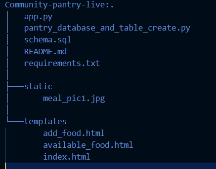

# Community Pantry
Welcome to Community Pantry, where kindness knows no bounds. Whether you're sharing your abundance or seeking a helping hand, our platform is your compassionate ally. Easily add surplus food items, knowing your contribution makes a meaningful difference. And for those seeking support, explore our offerings with comfort and assurance, knowing a caring community awaits with open arms.

## Inspiration
- The prevalent issue of food waste in communities, coupled with the need to support those unable to afford meals, is the driving force behind our initiative. 

## What it does
- Community Pantry allows users to list surplus food along with contact and pickup details. User can also view these listings, facilitating direct communication and food distribution to those who require assistance. 

## How we built it
- **Python web framework:** Flask
- **Python database:** SQLite3
- **Front-end:** HTML & CSS>

## Challenges we ran into
- Database connectivity and displaying data on HTML pages posed challenges.
- Due to time constraints we were not able to develop a robust app such as log in and sign up page for users and adding constraints in forms to receive data in the correct format in some fields.

## Solution
- Leveraging documentation for SQLite and Flask, we successfully implemented database operations and addressed connectivity issues.

## Accomplishments that we're proud of
- Developing a functional prototype that  addresses food waste while aiding those in need is a significant achievement for us. 
- Achieving successful database operations within the app


## What we learned
- We gained valuable experience in building web applications using Flask and integrating SQLite3 for database operations. 
- we learned the importance of addressing social issues through technology.
- Building with Flask enables dynamic content, complex functionality, and scalability
compared to static websites.

## What's next for Community Pantry
- Implement user authentication features to enhance security.
- Enhance the user interface for a more intuitive experience.
- Explore options for scalability and wider community impact.
# Setup
- Python 3.x should be installed (https://www.python.org/downloads/)
### Project structure


Use the line of code below to download Pizza Casa:
```
$ git clone https://github.com/ChrissyAFK/Community-Pantry-live.git
```
  In command prompt, navigate to  project directory and install dependencies.
```
$ cd Community-Pantry-live
$ pip install -r requirements.txt
```
Create a database and table to store records. For this, run follwing command.
```
$ python pantry_database_and_table_create.py
```
Now execute the app 
```
$ python app.py
```
Open browswer and paste  http://localhost:8000 to view and work with app

